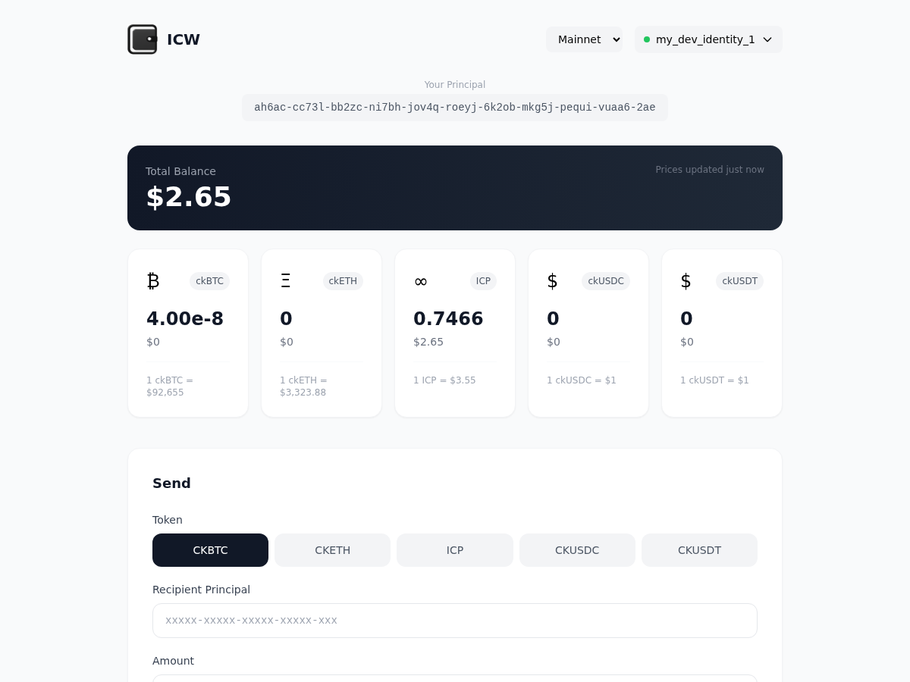
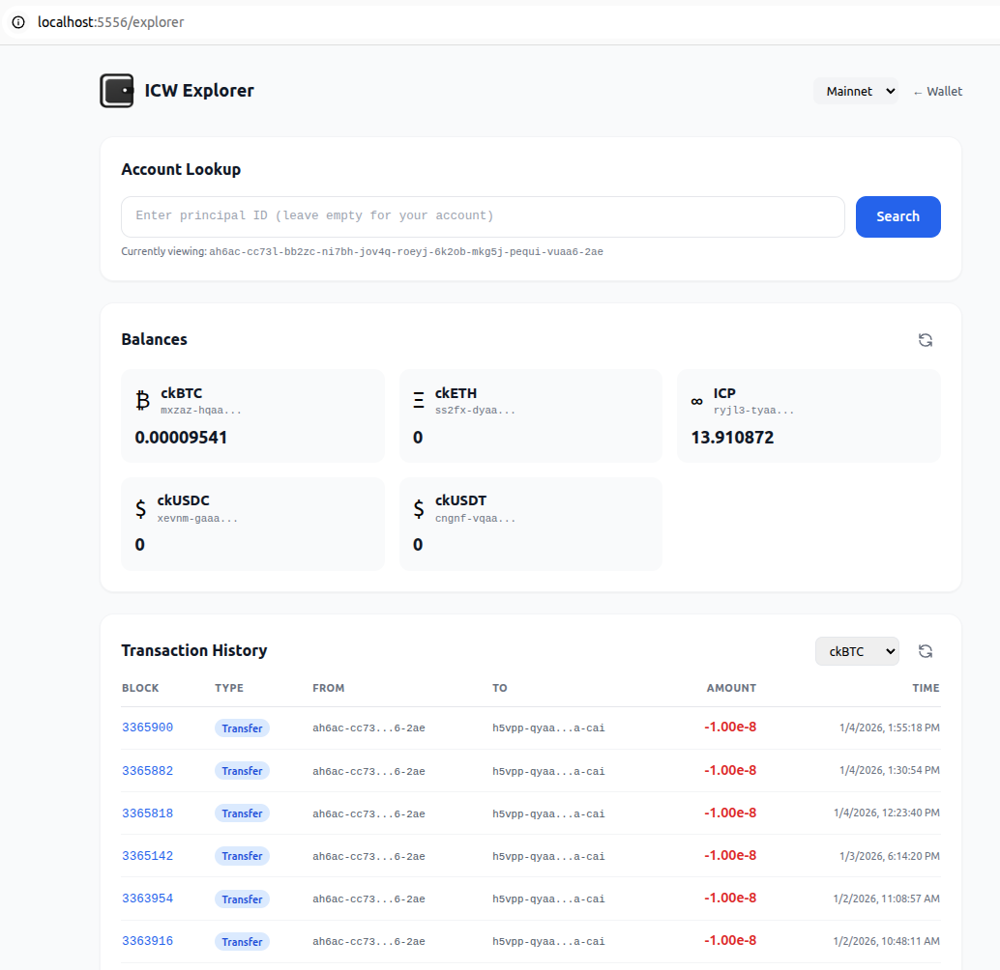

# ICW - ICP Wallet CLI

Simple CLI and Web UI for managing ICRC-1 tokens on the Internet Computer.

**Supported tokens:** ckBTC, ckETH, ICP, ckUSDC, ckUSDT, REALMS

> ⚠️ **WARNING**: This is experimental software. Do not use with significant amounts of funds. Use at your own risk.

## Web UI



```bash
pip install internet-computer-wallet[ui]
icw ui                    # Opens browser at http://localhost:5555
icw ui --port 8080        # Custom port
icw ui --no-browser       # Don't auto-open browser
```

### Explorer



Browse transaction history and balances for any account at `/explorer`.

```
http://localhost:5555/explorer                      # Your account
http://localhost:5555/explorer?account=<principal>  # Any account
```

**Features:**
- Look up balances for any principal across all supported tokens
- View transaction history (transfers, mints, burns) with timestamps
- Click any token balance to view its transactions
- Supports local network with custom ledger/index canister configuration

### Desktop Launcher (Linux)

```bash
icw install-launcher      # Adds "ICW Wallet" to your applications menu
```

## Install

```bash
pip install internet-computer-wallet
```

## Usage

```bash
# Check balance (auto-converts to USD)
icw balance                       # ckBTC (default)
icw -t cketh balance              # ckETH
icw -t icp balance                # ICP
icw -t ckusdc balance             # ckUSDC
icw -t ckusdt balance             # ckUSDT
icw -t realms balance             # REALMS
icw balance -p <principal> -s 1   # specific principal + subaccount

# Subaccounts (integer, hex, or text)
icw balance -s 1                  # integer (0-255)
icw balance -s savings            # text (max 32 ASCII chars)
icw balance -s 0a1b2c...          # hex (64 chars = 32 bytes)

# Transfer tokens
icw transfer <recipient> 0.001
icw transfer <recipient> 0.001 -s 1 -f 2       # to subaccount 1, from subaccount 2
icw transfer <recipient> 0.001 -s savings      # to "savings" subaccount
icw transfer <recipient> 0.001 -m invoice_123  # with memo/tag

# Mint tokens (NON-STANDARD - requires canister with 'mint' method)
icw mint 100                                   # mint to self
icw mint 100 -r <principal>                    # mint to recipient
icw mint 100 --ledger <canister_id>            # custom ledger

# Token info + current price
icw info                          # ckBTC (default)
icw -t icp info                   # ICP

# Identity management
icw id              # current identity + principal
icw id list         # list all identities
icw id use <name>   # switch identity
icw id new <name>   # create new identity

# Version
icw --version
```

## Output

All commands output JSON for easy parsing:

```json
{
  "token": "ckBTC",
  "balance": 0.001,
  "raw": 100000,
  "usd": 97.0,
  "price": 97000.0,
  "principal": "abc-xyz"
}
```

## Options

- `-t, --token`: Token (ckbtc, cketh, icp, ckusdc, ckusdt, realms). Default: ckbtc
- `-n, --network`: Network (ic, local). Default: ic
- `--ledger`: Override ledger canister ID (for local testing)
- `--fee`: Override transfer fee (for local testing)
- `-m, --memo`: Transaction memo/tag (max 32 bytes, for tracking payments)

## Local Development

To use `icw` with a local dfx replica:

```bash
cd tests

# Download ledger wasm artifacts
./download_artifacts.sh

# Start local replica
dfx start --clean --background

# Deploy test ledger with initial balance
dfx deploy ckbtc_ledger --no-wallet --yes --argument='(variant { Init = record { 
  minting_account = record { owner = principal "'$(dfx identity get-principal)'"; subaccount = null }; 
  transfer_fee = 0; token_symbol = "ckBTC"; token_name = "ckBTC Test"; decimals = opt 8; 
  metadata = vec {}; feature_flags = opt record { icrc2 = true };
  initial_balances = vec { record { record { owner = principal "'$(dfx identity get-principal)'"; subaccount = null }; 100_000_000_000 } }; 
  archive_options = record { num_blocks_to_archive = 1000; trigger_threshold = 2000; controller_id = principal "'$(dfx identity get-principal)'" } 
} })'

# Get ledger ID and use icw
LEDGER=$(dfx canister id ckbtc_ledger)
icw -n local balance --ledger $LEDGER
icw -n local transfer <recipient> 0.01 --ledger $LEDGER --fee 0
```

## Requirements

- Python 3.9+
- dfx (auto-installs if missing)
